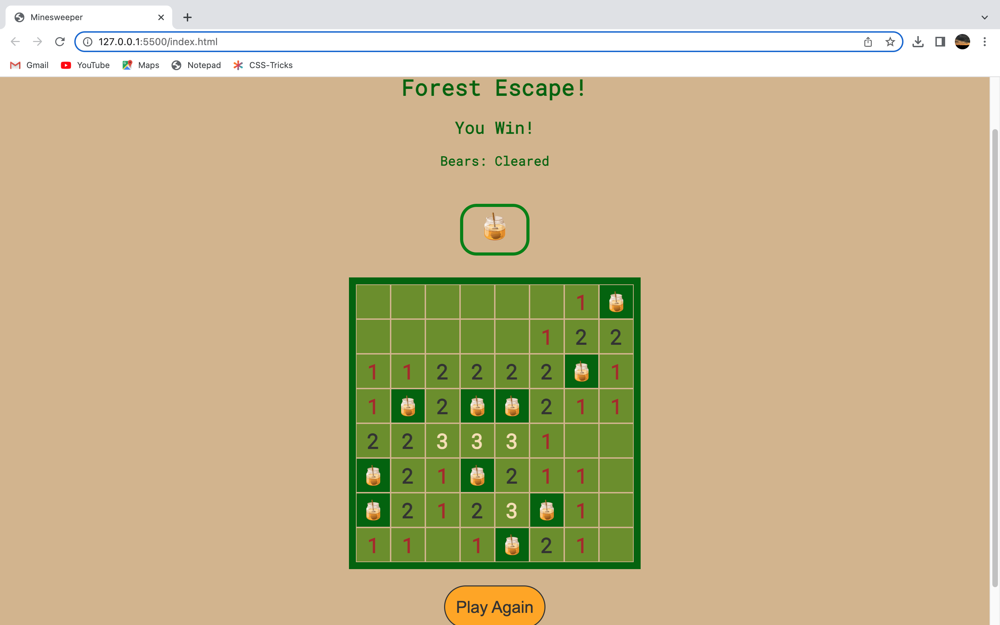

## faithGameProject1
## Name:  Forest Escape -> (Minesweeper Game)

Welcome to Forest Escape, a Minesweeper game with a forest theme! In this game, you find yourself in a dense forest filled with grizzly bears. The objective is to navigate the forest and avoid the bears by flagging their possible locations with jars of honey.

## How to Play:

1. Click on the tiles on the game board to reveal what's underneath. Each tile may contain a bear or be empty.
2. If you suspect a tile contains a bear, you can flag it by clicking on the tile with the "Flag" tool selected. This is represented by a jar of honey.
3. Be careful! If you click on a tile with a bear, the game ends, and you lose.
4. The numbers on the revealed tiles indicate the number of bears adjacent to that tile.
5. Use the numbers strategically to deduce the possible locations of bears and flag them with honey jars.
6. Continue revealing tiles and flagging potential bear locations until you have flagged all the bears or cleared all the safe tiles.
7. If you successfully flag all the bear locations without clicking on any bears, you win the game!

## Game Controls:

- Click on a tile: Reveal the tile.
- Click on the 'Honey" button to enable it: Flag or unflag a potential bear location with a honey jar by clicking on the space you want to 'flag' with the enabled "Honey" button.

## Game Features:

- Randomly generated bear locations ensure each game is unique and challenging.
- Beautiful forest-themed game board and graphics create an immersive experience.
- Visual cues such as numbers help you deduce the locations of bears and make strategic decisions.
- Play again feature allows you to start a new game at the end of each game.

## Getting Started:
 
 click the link below to play!
 https://ornate-sorbet-d2b205.netlify.app

## Game Screenshots:

## Technologies Used

- HTML
- CSS
- JavaScript

# Next Steps: 

- HTML: Since I went with a forest theme, it would be neat to create a background that resembles a forest or add/or a tree PNG to the hidden tiles. 

- CSS: I would love to make the words 'You Lose!' or 'You Win!' pop out of their positions and cover the screen at the end of each game for a dramatic effect. 

- Javascript: I would love to build different levels of game difficulty, perhaps three in total, where the grid gets larger each time and the number of bears increases. 